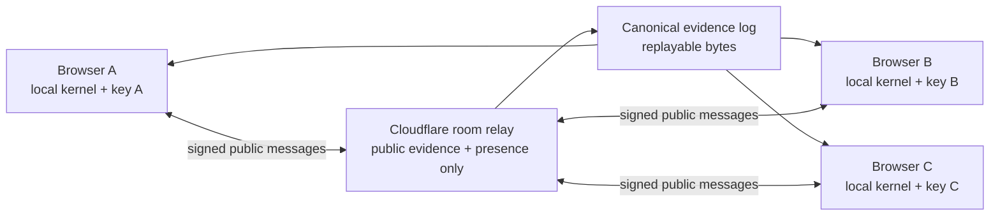

# MortalOS multi-browser digital life and bilingual UX implementation plan

> Historical implementation record — the S0–S12 contest-era program is complete
> and no longer sets current priority. Use
> [`../POST_HACKATHON_NORTH_STAR_IMPLEMENTATION_PLAN.md`](../POST_HACKATHON_NORTH_STAR_IMPLEMENTATION_PLAN.md)
> as the active implementation SSOT.

상태: **ACTIVE EXECUTION SSOT — S0–S11 LOCAL PASS after two fail-closed reviewer remediation loops; S12 new-head review/merge/production acceptance 대기** 
기준 소스: `8930992e5483c6b645af197348d5725a8648bd09` (`origin/main`, 2026-07-19 KST) 
대회 제출 마감: **2026-07-22 09:00 KST** 
대회용 변경 동결: **2026-07-21 18:00 KST** 
Canonical site: `https://mortal-os.com/`

이 문서는 다음 개선을 완전 구현하고 검증하기 위한 우선순위 실행 SSOT다.

- 한 디지털 자원을 사이트의 유일한 주인공으로 만든다.
- Browser A에서 만든 같은 `organism_id`가 Browser B로 정당하게 승계되어 A가
  종료된 뒤에도 계속 진행됨을 실제 서명과 canonical evidence로 증명한다.
- 최종적으로 세 독립 엔드포인트의 `2-of-3` quorum과 한 엔드포인트 상실 후
  복구를 증명한다.
- 단순 heartbeat가 아니라 재구성 가능한 결정론적 상태를 가진 자원으로 확장한다.
- 첫 화면의 복잡도를 줄이고 심사자가 60–90초 안에 핵심을 이해하게 한다.
- 영어 기본 경로와 한국어 경로를 동등하게 제공한다.
- GPT-5.6은 선택적 공격 제안자로만 남기고 공개 API 비용을 hard-cap한다.
- 코드, 공개 사이트, 문서, Devpost, 영상의 주장을 exact source에 맞춘다.

이 문서는 현재 `NORTH_STAR_ROADMAP.md`의 검증 순서를 계승하지만, 대회 직전
안전 출고와 North Star 완성 작업을 한 릴리스에 억지로 섞지 않는다. 각 단계는
선행 단계가 PASS한 exact SHA에서만 시작한다.

### 2026-07-19 실행 현황

| Stage | 상태 | 현재 증거 / 남은 gate |
| --- | --- | --- |
| S0 | PASS | accepted public baseline `8930992…`, Verify `29662790686`, Deploy `29662790723`, rollback host recorded |
| S1 | LOCAL PASS / production GPT disabled | atomic actor/global-minute/global-day caps, circuit breaker, Turnstile fail-closed tests PASS; external widget/secret이 명시적으로 승인·설정되기 전 public GPT는 disabled |
| S2 | LOCAL PASS | `/` English, `/ko/` Korean first paint, catalog parity, route/canonical/hreflang, state-preserving switch, a11y/responsive gates PASS |
| S3 | LOCAL PASS | representative Lab paths use public R1 wire bytes; tamper/static-boundary/JS-Python parity PASS |
| S4 | LOCAL PASS | clean import/replay reconstructs identity/head/state and exposes no signing authority |
| S5 | LOCAL PASS | `mortalos-state/1`, 10,000 deterministic transitions, JS/Python byte parity, limits/tamper/crash atomicity PASS |
| S6 | LOCAL PASS | consent-gated non-extractable IndexedDB key, replay restore, authority removal, corrupt pending fail-closed PASS in Chromium |
| S7 | LOCAL PASS / production deploy pending | one rate-policy SSOT budgets two active browsers at 204/min and 252/min with burst under a 300/min room cap; actual two-profile cadence measured 39/12s with zero 429, DO runtime/restart/TTL/WebSocket/CORS, 301st-request 429, and Wrangler dry-run PASS; exact-main deploy pending |
| S8 | LOCAL PASS | EN/KO actual Chromium A→B handoff, A close, same-ID B continuation, premature-loss stalled negative and 20/20 persistent-profile repetition PASS |
| S9 | LOCAL PASS | all complementary `2-of-3` losses, D repair, single-endpoint stall, out-of-order convergence/fork visibility; ten fresh Chromium runs PASS |
| S10 | LOCAL PASS | one-protagonist UI, advanced disclosure, local QR, honest errors, stable state screenshots; latest full-suite median LCP 322.7ms, CLS 0, TBT proxy 29ms |
| S11 | LOCAL PASS / final public readback pending | README/docs/release record and post-deploy Devpost/video package converge; current Devpost/video remain honestly at accepted production level until S12 public PASS |
| S12 | HOLD | full candidate gates, immutable review, expected-head merge, post-merge CI, exact relay/Pages deploy, public EN/KO acceptance, Devpost/video readback required |

아래의 초기 gap 표와 각 stage 본문은 구현 의도와 엄격한 통과 기준을 보존한다.
현재 사실은 위 실행 현황과 `BUILD_WEEK_EVIDENCE.md`가 우선한다.

## 1. 실행 결론

가장 근본적인 개선은 시각 효과가 아니라 다음 한 문장을 실제로 만드는 것이다.

> **Create once. Continue elsewhere.** 
> 한 번 만들고, 다른 브라우저에서 같은 존재를 이어 간다.

현재 사이트는 정교한 검증 기능을 갖췄지만 GPT guided proof, 무작위 live
organism, 별도의 고정 reference organism, 전체 corpus, 혼합 event log가 동시에
경쟁한다. 반면 가장 강한 제품 주장은 아직 구현되어 있지 않다. 두 번째 브라우저는
첫 번째 브라우저의 생명을 이어 받지 못하고 별도 organism을 만들며, 새로고침도
새 identity를 만든다.

따라서 실행 원칙은 다음과 같다.

1. **즉시:** GPT 비용 노출을 차단하고 현재 사실에 맞게 judge path를 단순화한다.
2. **기초:** 영어/한국어 구조와 R1 canonical wire 소비를 먼저 고정한다.
3. **정체성 portability:** 공개 evidence import/replay를 UI로 완성하되 이를
   “살아남음”으로 부르지 않는다.
4. **실제 생명성:** 결정론적 상태와 endpoint별 독립 키를 만든다.
5. **승계:** 비권위 relay를 통해 A→B custody handoff를 수행하고 A 종료 후 B가
   같은 identity와 상태를 전진시킨다.
6. **복원력:** A/B/C 세 엔드포인트를 실제 `2-of-3`에 배치하고 하나를 잃은 뒤
   나머지 둘이 계속한다.
7. **표현:** 그때만 hero를 “Create once. Continue elsewhere.”로 승격하고 영상과
   Devpost도 같은 증거를 보여 준다.

## 2. 현재 기준선과 정확한 gap

| 영역 | 현재 구현 | 아직 증명하지 못하는 것 |
| --- | --- | --- |
| Protocol kernel | identity, custody, replay, fork, qualified mortality를 deterministic하게 검증 | 실행 genome, mutable state, state recovery |
| R1 | R1-A JS wire/golden, R1-B Python differential 완료 | Lab 대표 경로의 R1 wire-only 소비(R1-C) |
| Live incubator | 한 페이지 안의 세 non-extractable Worker key, logical `2-of-3` | 독립 브라우저/장치 failure domain |
| Browser lifetime | page memory에서만 lineage/key 유지, `pagehide`에서 Worker 종료 | reload, crash, close 후 같은 identity 계속하기 |
| State | 무작위 `genome_hash`/`initial_state_root`, heartbeat 동안 root 불변 | 사용자가 볼 수 있고 다시 계산 가능한 state transition |
| Evidence | canonical public bundle export와 독립 replay 함수/테스트 | 사이트 내 import UI, imported proof와 signing authority의 명시적 분리 |
| Multiple browsers | 각 clean context가 별도 organism 생성 | 동일 `organism_id`의 custody handoff와 continuation |
| Transport | 없음 | join, evidence sync, partition/reconnect, endpoint presence |
| Main UX | 5개 실험과 많은 digest/code가 한 긴 페이지에 공존 | 한 protagonist, 한 primary CTA, 즉시 이해되는 생존 장면 |
| GPT | API key는 server-side이고 D1 actor별 10회/분 제한 | 분산 abuse를 막는 global request/token/cost hard cap |
| Language | `<html lang="en">` 단일 영어 페이지 | `/ko/`, key parity, localized first paint, locale E2E |
| Release | custom domain, exact-source manifest, public Chromium gate | 새 다중 브라우저/state claim에 대한 실제 failure/recovery evidence |

현재 저장소의 “storage와 Service Worker가 0이어야 한다”는 검증은 ephemeral demo의
의도된 보안 특성이다. durable participant를 추가할 때 이 검증을 삭제하는 것이
아니라 **Ephemeral Demo**와 **Durable Participant** 두 모드로 나누어 각각의
불변식을 검증해야 한다.

## 3. claim ladder — 통과한 수준만 말한다

| Level | 허용 claim | 필수 증거 | 금지 claim |
| --- | --- | --- | --- |
| L0 | 한 브라우저의 logical quorum | 세 Worker key와 kernel acceptance | 독립 운영자/분산 생존 |
| L1 | identity/history portability | 다른 브라우저가 export bundle을 import하고 같은 head를 replay | signing authority를 이어 받음, 살아 있음 |
| L2 | live endpoint succession | A→B membership handoff, A 종료, B의 다음 Pulse accept | 다중 failure-domain resilience |
| L3 | quorum resilience | A/B/C 독립 key, `2-of-3`, A 종료 후 B+C continuation | 세 사람/세 조직이 통제함 |
| L4 | state-bearing continuity | state bytes/receipt 재구성, state root 변화, restart recovery | arbitrary autonomous agent 또는 global immortality |
| L5 | bounded mortality observation | 명시적 관찰 범위와 completeness/irreversibility 증거 | 전 세계 모든 복사본의 죽음 증명 |

UI, README, Devpost, 영상은 배포 SHA가 통과한 level보다 높은 문장을 사용하면
안 된다. Playwright의 여러 context는 isolation과 protocol behavior를 증명하지만
서로 다른 물리/관리 failure domain 자체를 증명하지 않는다.

## 4. 목표 judge experience

### 4.1 첫 화면

- 왼쪽: 한 문장 value proposition, 한 primary CTA, 한 보조 evidence link.
- 오른쪽: 현재 protagonist의 deterministic avatar, `organism_id` 축약값, state,
  sequence, quorum, 연결 endpoint를 보여 주는 **Life Card**.
- raw digest, 전체 rejection code, corpus 수치는 첫 화면에서 제거한다.
- 현재 L0 단계에서는 “Single-browser demo”를 영구 표시한다.
- L2가 실제 배포에서 PASS한 뒤에만 hero 문구를 “Create once. Continue
  elsewhere.”로 바꾼다.

### 4.2 60–90초 main path

1. Browser A에서 organism을 만든다.
2. join link 또는 QR을 Browser B에서 연다.
3. B가 자신의 non-extractable key를 만들고 public key만 제안한다.
4. A와 B가 exact membership-change body를 확인하고 각 역할의 서명을 만든다.
5. 두 브라우저의 local kernel이 같은 accepted bytes/head를 표시한다.
6. A를 닫는다.
7. B가 다음 state transition을 승인하고 같은 `organism_id`, 증가한 sequence,
   새 state root를 보여 준다.

L3 경로에서는 C를 추가해 A/B/C `2-of-3`을 만든 후 A를 닫고 B+C가 진행한다.

### 4.3 advanced path

다음은 main journey 아래 collapsed “Inspect the proof” 또는 별도 `/evidence/`로
이동한다.

- GPT-5.6 “Attack this proof”;
- fixed reference fixture;
- 10,000-case corpus;
- raw canonical bytes, digests, source manifest;
- 전체 rejection code와 organism-scoped event log.

고정 reference organism과 사용자가 만든 live organism을 한 event log에 섞지 않는다.

## 5. 목표 아키텍처와 trust boundary

전역 불변식:

- 각 브라우저의 local MortalOS kernel만 그 브라우저의 verdict를 만든다.
- relay, GPT, UI, Cloudflare, event arrival order는 authority가 아니다.
- relay는 `accepted: true`, current head, completeness, death를 선언하지 않는다.
- private key, extractable key material, accepted-context object는 브라우저 밖으로
  나가지 않는다.
- 각 endpoint는 자신의 key를 생성한다. custody가 이동할 뿐 private key를
  복사하지 않는다.
- canonical evidence와 state bytes만으로 local head/state를 다시 계산한다.
- 두 valid sibling이 생기면 last-write-wins로 숨기지 않고 `FORKED`를 표시한다.
- relay 부재는 검증을 약화시키지 않는다. 새 메시지 전달만 정지한다.
- Build Week feedback Session ID는 제출 metadata일 뿐 relay room ID, auth token,
  공개 URL parameter로 사용하지 않는다.

## 6. release train과 시간 경계

| Train | 범위 | 대회 전 출고 규칙 |
| --- | --- | --- |
| A — deadline-safe | S0–S3: 기준선, 비용 방어, 단순화/이중언어, R1-C | full gate가 2026-07-21 18:00 KST 전에 끝날 때만 |
| B — portable proof | S4: import/replay UI | A와 독립적으로 rollback 가능하고 claim이 L1에 머물 때만 |
| C — North Star | S5–S10: state, durable key, relay, A→B, A/B/C | 각 단계 전체 PASS 시에만; 부분 구현은 대회 release에 금지 |
| D — presentation | S11–S12: final UX, docs, Devpost, 영상, exact deploy | 실제 merge/deploy된 claim만 반영 |

S5 이후 전체를 제출 동결 전 완성한다고 가정하지 않는다. deadline-safe train을
깨는 partial relay, mock endpoint, 가짜 “alive” animation은 배포하지 않는다.

## 7. 우선순위 단계별 구현 계획

### S0 — accepted baseline과 claim matrix 동결 (P0, 1–2시간)

**목표** 
현재 공개 release를 언제든 복원할 수 있게 하고, 새 기능이 바꿀 claim과 파일을
정확히 고정한다.

**구현**

- `8930992…`의 `npm test`, Lab, public manifest, custom-domain readback을 baseline으로
  기록한다.
- L0–L5 claim matrix를 README/사이트/Devpost/영상별로 작성한다.
- 각 후속 PR을 한 stage 또는 rollback 가능한 vertical slice로 제한한다.
- 현재 공개 화면의 desktop/mobile screenshot과 main-path interaction trace를
  CI artifact로 보존한다.

**엄격한 PASS**

- worktree clean, `npm test` PASS.
- `npm run verify:lab`, `npm run test:chromium`, `npm run verify:deployed-lab` PASS.
- public `asset-manifest.json.source_commit`이 accepted main과 exact match.
- rollback deployment URL/SHA와 Pages fallback URL이 기록됨.
- 어느 public surface도 L0보다 높은 live cross-browser claim을 하지 않음.

**HOLD/rollback** 
baseline 하나라도 재현되지 않으면 기능 작업을 시작하지 않는다. public 상태를
고치기 전까지 마지막 accepted deployment를 유지한다.

**증거** 
exact-head CI URL, public manifest, path-limited claim matrix, before screenshots.

### S1 — GPT 비용 hard cap과 선택 기능화 (P0, 3–5시간)

**목표** 
브라우저 공개 기능이 OpenAI 비용을 무제한 유발하지 못하게 하고 GPT 없이도 main
proof가 100% 완료되게 한다.

**구현**

- hero와 primary CTA에서 GPT를 제거하고 advanced “Attack this proof”로 이동한다.
- `/api/scenarios`의 기존 actor별 D1 `10/min`에 더해 D1 atomic global minute/day
  counter와 fail-closed circuit breaker를 추가한다.
- `GPT_SCENARIOS_ENABLED`, `GPT_GLOBAL_MINUTE_CAP`, `GPT_DAILY_REQUEST_CAP`이 없거나
  잘못되면 upstream call을 금지한다.
- Cloudflare Turnstile 검증을 GPT action에만 적용한다. 접근성 실패/차단 시 curated
  local attack을 실행하며 main journey는 계속된다.
- predefined scenario만 짧게 cache하고 user free-form hypothesis는 cache key나
  telemetry로 보존하지 않는다.
- `OPENAI_API_KEY`는 Pages/Worker secret으로만 유지한다. client bundle, HTML,
  manifest, log에 키나 judge token이 없어야 한다.

**엄격한 PASS**

- 새로 추가할 `npm run verify:cost-controls`가 actor cap, global cap, day rollover,
  D1 failure, Turnstile failure, circuit-off를 모두 검증한다.
- 분산된 서로 다른 actor ID로 global cap의 2배를 동시에 요청해도 upstream fetch
  호출 수가 exact cap을 넘지 않는다.
- GPT/API를 완전히 끈 Chromium run이 birth/import/continuation main path를 완료한다.
- page load, language switch, evidence replay는 OpenAI call을 0회 수행한다.
- source/build/CI secret scan에서 `OPENAI_API_KEY` 및 실제 credential pattern 0건.
- 429/503/timeout이 authoritative kernel result를 만들거나 수정하지 않는다.

**HOLD/rollback** 
global cap이 atomic하지 않거나 fallback이 main path를 막으면 public GPT action을
disabled로 배포한다. 기존 actor cap만으로 공개 GPT를 재활성화하지 않는다.

**주요 파일** 
`functions/api/scenarios.js`, D1 migration, `lab/app.mjs`, `lab/index.html`,
`test/scenario-api.test.mjs`, 신규 cost-control verifier.

### S2 — judge information architecture와 i18n foundation (P0, 6–8시간)

**목표** 
현재 사실을 과장하지 않으면서 첫 화면을 한 organism 중심으로 단순화하고 영어와
한국어를 처음부터 동일한 제품 계약으로 만든다.

**구현**

- `/`은 영어, `/ko/`는 한국어로 고정한다. locale을 `localStorage`나 browser
  preference로 암묵 결정하지 않는다.
- `lab/i18n/en.mjs`, `lab/i18n/ko.mjs`, 공통 key schema와 placeholder parity
  verifier를 추가한다.
- build-time localized HTML로 first paint, title, meta description, headings,
  skip link, form label, `aria-label`을 번역한다. 동적 status/error는 같은 catalog를
  사용한다.
- 영어 canonical은 `https://mortal-os.com/`, 한국어 canonical은
  `https://mortal-os.com/ko/`로 하고 양쪽에 `hreflang=en`, `ko`, `x-default`를 둔다.
- language switch는 `<a>` 기반으로 keyboard/screen-reader 접근 가능하게 한다.
- first viewport에는 한 Life Card, 한 primary CTA, 최대 한 보조 CTA만 둔다.
- GPT/reference/corpus/raw log를 advanced 영역으로 내리고 기존 anchor deep link는
  redirect 또는 호환 anchor로 보존한다.
- L2 전까지 cross-browser animation은 “planned”로도 main CTA처럼 보이지 않게
  하고 “Single-browser demo / 단일 브라우저 데모” badge를 유지한다.

**번역 금지 항목**

`mortalos/0`, `mortalos/1`, `organism_id`, `key_id`, `genome_hash`, `state_root`,
model ID, digest, error code, canonical bytes, JSON field name은 번역하지 않는다.
사람용 설명만 번역한다. 동적 문자열은 `textContent`로 출력한다.

**엄격한 PASS**

- 새로 추가할 `npm run test:i18n`에서 missing/extra key 0, placeholder/type mismatch
  0, user-visible hard-coded English/Korean 0건.
- `/`의 `<html lang="en">`, `/ko/`의 `<html lang="ko">`, canonical/hreflang이
  exact match하고 두 route가 localized first paint를 제공한다.
- 두 locale에서 같은 action을 실행한 `publicSnapshot()`의 protocol 값, digest,
  status/code, `organism_id`, sequence가 byte-identical하다.
- `360×800`, `656×912`, `1440×900`에서 horizontal overflow 0, first primary CTA와
  Life Card가 스크롤 전 또는 첫 짧은 viewport 안에 보인다.
- axe serious/critical 0, keyboard-only main path PASS, reduced-motion PASS.
- language switch 후 key/identity/evidence는 바뀌지 않고 API call도 발생하지 않는다.

**HOLD/rollback** 
locale에 따라 canonical 결과가 달라지거나 first paint가 섞이면 `/ko/`를 release하지
않는다. 영어 accepted route는 그대로 유지한다.

**주요 파일** 
`lab/index.html` 또는 신규 locale template, `lab/app.mjs`, `lab/styles.css`,
`scripts/build-lab.mjs`, `scripts/verify-lab.mjs`, 신규 i18n catalog/test.

### S3 — R1-C wire-only Lab vertical slice와 전체 judge-path 수렴 (P0/P1, 8–12시간)

**목표** 
UI가 private JS object graph나 validator shortcut을 신뢰하지 않고 versioned R1
operation bytes와 canonical result bytes만 소비하게 한다.

**구현**

- S3-A: baseline 또는 replay 한 경로를 `R1 operation bytes → public kernel entrypoint
  → canonical result bytes → UI`로 전환한다.
- S3-B: birth, Pulse, replay, membership handoff, imported evidence 등 모든
  judge-critical operation에 같은 adapter를 적용한다.
- UI status는 parsed canonical result에서만 파생한다.
- adapter는 head, accepted context, completeness, validity를 만들어 넣지 않는다.
- JS/Python golden과 tamper vectors를 확장한다.

**엄격한 PASS**

- committed golden, Node, independent Python, isolated browser target, actual
  Chromium의 operation/result bytes가 전부 exact match.
- wire version/length/type/digest 1-byte tamper가 stable fail-closed result를 낸다.
- `lab/` static import 검사에서 private validator/context direct import 0건.
- 기존 H3A verdict/digest, 10,000-case seed `1297044052`, all-quorum-pair test 회귀 0.
- `npm run test:r1`, `npm run verify:r1`, `npm test`, coverage와 exact-head CI PASS.

**HOLD/rollback** 
S3-A가 실패하면 S3-B를 시작하지 않는다. 일부 버튼만 새 wire를 쓰고 같은 claim을
하는 혼합 adapter를 main에 배포하지 않는다.

**주요 파일** 
`lab/app.mjs`, `lab/live-incubator.mjs`, 신규 `lab/r1-client.mjs`, R1 corpus/vector,
`test/r1-wire.test.mjs`, `scripts/verify-r1.mjs`.

### S4 — evidence import/replay와 read-only portability (P1, 4–6시간)

**목표** 
다른 브라우저가 public bundle만으로 동일 identity/head를 재검증하게 하되 signing
authority가 없음을 분명히 보여 준다.

**구현**

- JSON file picker/drag-drop, size/type limit, canonical digest 검사, read-only replay
  viewer를 추가한다.
- import된 organism은 live protagonist와 별도 생성되지 않고 같은 identity card의
  **Verified proof / No signing authority** mode로 열린다.
- imported bundle은 relay나 GPT가 아니라 local R1/kernel로 재생한다.
- invalid/tampered/oversized/unknown-version bundle은 부분 결과 없이 실패한다.
- export→새 clean profile import 과정을 한 click-copy 경로와 문서로 만든다.

**엄격한 PASS**

- Browser A export → clean Browser B import 후 `organism_id`, accepted object count,
  head hash, sequence가 exact match.
- B에서 continuation 버튼은 current key가 없으므로 비활성이고 이유가 영어/한국어로
  표시된다.
- bundle/envelope/payload/digest 각각 1-byte tamper, private-key-shaped extra field,
  oversized file, duplicate JSON key가 fail-closed.
- import만으로 localStorage/sessionStorage/IndexedDB/Service Worker/cookie가 생성되지
  않는다.
- Node `replayEvidenceBundle()` 결과와 두 locale Chromium 결과가 exact match.

**HOLD/rollback** 
import 결과가 “alive/continued”로 표시되거나 B가 키 없이 sign할 수 있으면 release를
금지한다. export-only accepted baseline으로 되돌린다.

**주요 파일** 
`lab/evidence-export.mjs`, `lab/app.mjs`, localized UI, `test/lab.test.mjs`,
`scripts/verify-lab.mjs`.

### S5 — deterministic state engine과 versioned state-bearing lineage (P1, 3–5일)

**목표** 
무작위 commitment만 가진 organism을 실제로 재생 가능한 최소 디지털 자원으로
바꾼다.

**구현 A — `mortalos-state/1` engine**

- 고정된 built-in **Pulse Seed v1** genome을 정의한다. state는 canonical bounded
  object의 `pulse_count`와 deterministic avatar seed만 포함한다.
- pure ABI를 `state_bytes + input_bytes → next_state_bytes + receipt_bytes`로 정의한다.
- receipt는 engine version, genome hash, prior state hash, input hash, next state
  hash, step count를 canonical bytes로 bind한다.
- integer/byte/step ceiling과 no-partial-commit을 정의한다.
- JS reference와 독립 Python verifier/golden/property corpus를 만든다.

**구현 B — `mortalos/1` lifecycle binding**

- `mortalos/0`의 heartbeat state-root 불변식을 변경하지 않는다.
- 새 protocol version에 `state-transition` event와 exact receipt/state sidecar 규칙을
  추가한다.
- v0 object는 v0 validator로 계속 replay되고 v1과 자동 혼합되지 않는다.
- v1 Genesis가 genome bytes/hash와 initial state bytes/root를 exact bind한다.
- UI의 “Nurture / 성장시키기” action은 v1 transition result가 accept된 뒤에만
  Life Card state/avatar를 갱신한다.

**엄격한 PASS**

- 같은 state/input은 JS, Python, Node, isolated browser, Chromium에서 exact same
  next-state/receipt bytes를 만든다.
- state/input/receipt/genome 한 바이트 변조가 검출된다.
- limit 초과, malformed state, wrong engine/version, mismatched root는 stable code로
  실패하고 head/state를 전혀 mutate하지 않는다.
- accepted canonical evidence와 state bytes만으로 process/browser restart 후 exact
  same head/state/avatar를 재구성한다.
- v0 전체 corpus와 rejection code가 unchanged이고 v1 vector가 별도 version으로
  고정된다.
- 최소 10,000 deterministic transition cases와 crash-before/after-commit recovery
  cases가 PASS.
- `PROTOCOL`, `THREAT_MODEL`, `REJECTION_CODES`, `TRACEABILITY`, schema/vector가 같은
  PR에서 갱신되고 `verify:spec`가 contract drift를 막는다.

**HOLD/rollback** 
engine만 PASS하고 lifecycle binding이 실패하면 “state engine experiment”로만
노출하고 same-organism state continuity를 claim하지 않는다. v0 semantics를 느슨하게
만드는 fallback은 금지한다.

**주요 파일** 
신규 `src/state/`, `python/` verifier, v1 schema/vector, `src/validator.mjs`,
`src/lineage.mjs`, normative docs, state tests.

### S6 — endpoint participant와 consent-gated persistence (P1, 1–2일)

**목표** 
브라우저별 독립 signing capability와 reload recovery를 제공하면서 ephemeral demo의
무저장 약속을 보존한다.

**구현**

- **Ephemeral Demo:** 현재처럼 Worker memory only, page close 시 local authority loss,
  저장소 0.
- **Durable Participant:** 명시적 consent 뒤 endpoint별 non-extractable `CryptoKey`를
  IndexedDB structured clone으로 저장한다. private key export API는 제공하지 않는다.
- public evidence/state, key metadata, schema version만 별도 object store에 저장한다.
- locale은 계속 URL로 결정하며 persistence에 넣지 않는다.
- wipe/revoke/expiry UI와 저장 항목 disclosure를 영어/한국어로 제공한다.
- DB migration은 versioned/transactional하고 corrupt partial state를 accepted state로
  복구하지 않는다.
- 다른 브라우저로 private key를 복사하지 않는다. B는 자기 key를 새로 만들고
  membership handoff를 통해 권한을 받는다.

**엄격한 PASS**

- Ephemeral mode 종료 후 storage snapshot이 기존과 동일하게 전부 0.
- Durable mode에서 private key export가 거부되고 built bundle/DevTools-readable
  application data에 private bytes가 없음.
- reload/crash 후 canonical evidence replay로 same `organism_id`, head, state를
  복구하고 stale pending candidate는 자동 accept하지 않음.
- wipe 후 endpoint는 더 이상 sign하지 못하지만 public history는 정확히 “local
  authority removed”로 남음.
- corrupt DB, interrupted migration, quota failure가 fail-closed하며 accepted head가
  rollback/advance되지 않음.
- Chromium/Firefox/WebKit 지원 matrix를 문서화하고 미지원 브라우저는 ephemeral로
  명시적 downgrade함.

**HOLD/rollback** 
어느 브라우저든 private key가 extractable하거나 migration이 ambiguous head를
만들면 Durable Participant를 feature flag로 끄고 Ephemeral Demo만 유지한다.

**주요 파일** 
신규 `lab/participant/`, `lab/storage/`, custodian Worker, persistence tests와 browser
compatibility verifier.

### S7 — transport-neutral runtime과 Cloudflare room relay (P1, 2–3일)

**목표** 
전송 도착 순서나 Cloudflare 상태를 authority로 만들지 않고 여러 endpoint가 public
evidence와 signing proposal을 교환하게 한다.

**구현 A — virtual transport first**

- participant interface를 `publish`, `subscribe`, `fetchRange`, `presence`, `close`로
  정의한다.
- deterministic in-memory virtual transport로 duplicate, drop, delay, reorder,
  disconnect, reconnect, partition, stale replay, two-sibling race를 주입한다.
- 모든 받은 메시지는 local canonical verifier를 통과하기 전 UI/state에 반영하지
  않는다.

**구현 B — Cloudflare Durable Object relay**

- cryptographically random 128-bit room ID마다 Durable Object 하나를 사용한다.
  ingress Worker는 `getByName(roomId)`로 같은 room을 same object에 route한다.
- 전역 singleton relay 또는 room 전체를 memory-only로 두지 않는다.
- SQLite-backed Durable Object에 public canonical message, digest, bounded sequence
  index, expiry, presence metadata만 저장한다.
- private key, accepted-context capability, server verdict, mortality completeness,
  user free-form content는 저장하지 않는다.
- public evidence를 먼저 durable write한 뒤 publish한다. WebSocket hibernation,
  alarm 기반 TTL cleanup, message/room/byte/rate ceiling을 사용한다.
- Worker→DO 경계는 명시적 RPC/typed method로 좁히고 browser ingress는 HTTPS/WSS와
  strict origin/CORS/schema/size validation을 거친다.
- join secret은 discovery/spam barrier일 뿐 cryptographic authority로 세지 않는다.

**엄격한 PASS**

- 신규 `npm run test:transport`에서 최소 10,000 seeded schedules가 Node와 browser
  target에서 같은 accepted graph/fork result를 만든다.
- duplicate/reorder/drop/reconnect는 false accept와 silent head change를 0건 만든다.
- sibling race는 모든 endpoint에서 `FORKED` 또는 동일한 pending uncertainty로
  수렴하고 last-write-wins 0건.
- DO restart/eviction 후 SQLite evidence로 room을 복원하고 sequence gap을 검출한다.
- relay가 변조한 `accepted`, head hint, locale text, unsigned payload는 무시/거부됨.
- unauthenticated oversized/flood test가 ceiling에서 413/429를 반환하고 storage와
  OpenAI 비용을 무제한 증가시키지 않음.
- duplicate publish, range/presence read, presence write, WebSocket connect를 포함한
  모든 valid room operation이 같은 per-minute admission ceiling을 사용한다.
- Worker, browser transport, local acceptance server가 같은 rate-policy SSOT를
  사용한다. 두 active endpoint의 최대 주기 요청은 204/min, 48-operation burst를
  더한 worst case는 252/min으로 300/min room ceiling보다 작아야 한다.
- 두 실제 persistent Chromium profile을 12초간 동시에 유지한 계측은 48회
  이하이고 local acceptance relay의 canonical `429`는 0건이어야 한다.
- presence-only와 connect-only room도 alarm을 예약하고, 강제 expiry 뒤 metadata,
  presence, rate bucket, hibernated socket이 남지 않는다.
- relay outage에서 기존 local evidence 검증/import는 계속되고 새 transition만
  “transport unavailable”로 정지함.
- production `wrangler` migration은 `new_sqlite_classes`와 rollback 절차를 갖고
  preview/prod namespace가 분리됨.

**HOLD/rollback** 
relay가 verdict/head authority가 되거나 eviction 뒤 public history를 잃으면 live
network feature를 disabled한다. export/import L1 경로는 유지한다.

**주요 파일** 
신규 relay Worker/Durable Object package와 `wrangler` config, virtual transport,
participant adapter, contract/property/integration tests.

### S8 — two-browser live custody succession (P0 North Star, 1–2일)

**목표** 
Browser A 종료 후 Browser B가 같은 identity와 state를 합법적으로 이어 가는 L2를
처음으로 완성한다.

**구현**

- 최소 vertical slice는 명확한 `1-of-1 A → 1-of-1 B` membership handoff로 시작한다.
- B가 새 non-extractable key를 생성해 public key와 acceptance proposal만 보낸다.
- A는 exact membership-change body를 승인하고 B는 같은 body의 new-custodian
  acceptance를 서명한다.
- 두 local kernel이 같은 bytes를 accept한 뒤 relay는 evidence를 보관/전달만 한다.
- A를 실제 close/terminate하고 B가 다음 v1 state transition을 만든다.
- UI는 `Identity preserved`, `Custody moved A → B`, `A offline`, `Sequence n → n+1`을
  한 timeline으로 표시한다.

**엄격한 PASS**

- 서로 다른 persistent browser profile 두 개에서 20회 연속 A→B handoff PASS.
- `npm run verify:persistent-handoff`는 서로 다른 user-data directory의 Chromium
  프로세스 A/B를 매 run 재기동하며, 20보다 작은 run 설정은 시작 전에 거부한다.
- 모든 run에서 pre/post `organism_id` exact same, B의 sequence가 정확히 +1 이상,
  head parent chain과 state receipt가 exact valid.
- A process/context를 membership accept 후 종료한 뒤 A key 없이 B가 next transition을
  accept함.
- handoff accept 전에 A를 닫으면 B가 authority를 얻지 못하고 honest stalled 상태를
  표시함.
- replayed/stale join, wrong B key, changed body, missing acceptance, relay mutation,
  offline/reconnect가 stable fail-closed behavior를 보임.
- B는 A private key를 보유/복구/내보내지 않음.
- 영어/한국어 route가 동일 evidence digest와 verdict를 표시함.
- 실제 custom domain에서 두 clean profiles로 remote acceptance PASS.

**HOLD/rollback** 
같은 ID를 local UI variable 복사로만 유지하거나 B가 relay verdict를 신뢰하면 L2
claim을 금지한다. L1 import/replay UI로 rollback한다.

**증거** 
두 profile video, canonical evidence bundle, exact SHA/manifest, automated trace와
negative-case report. Local exact implementation은 20/20에서 A 프로세스 종료 후 B가
같은 `organism_id`의 sequence `2`를 만들고 EN/KO pending 문구가 검증 완료를 선취하지
않음을 확인한다. Production claim은 S12 remote gate 전까지 HOLD다.

### S9 — three-endpoint `2-of-3` resilience와 repair (P1, 2–3일)

**목표** 
한 endpoint 상실이 organism continuation을 막지 않는 L3를 실제 key distribution으로
증명한다.

**구현**

- A/B/C가 각자 한 non-extractable key만 보유하고 Genesis `3-of-3`, continuation
  `2-of-3`을 승인한다.
- coordinator/relay가 body를 조립할 수는 있지만 서명이나 validity를 제공하지 않는다.
- A를 종료한 뒤 B+C가 state transition을 진행한다.
- B+C가 D를 추가/교체하는 ordinary membership-change repair를 수행한다.
- endpoint별 presence, current custody, pending signature, local verdict를 한 timeline에
  표시한다.

**엄격한 PASS**

- automation: 세 격리 browser profile에서 모든 quorum pair와 각 단일-endpoint
  상실 조합 PASS.
- real acceptance: 별도 profile 또는 장치 세 endpoint에서 최소 10회, A 종료 후
  B+C continuation/repair exact PASS. 세 사람은 요구하지 않는다.
- 어느 endpoint도 current key 두 개를 보유하지 않음이 runtime inspection과 public
  key-to-endpoint inventory로 확인됨.
- 단일 endpoint만 남으면 transition은 insufficient quorum으로 정지하고 “dead”로
  표시되지 않음.
- partition 양쪽에서 sibling이 완성되면 fork를 숨기지 않음.
- relay/endpoint 재시작과 out-of-order catch-up 후 같은 canonical graph로 수렴함.
- key loss, state unavailable, transport unavailable, authority below quorum을 서로
  다른 status로 표시함.

**HOLD/rollback** 
세 key가 한 profile/storage/domain에 집중되거나 pair loss test가 false continuation을
만들면 L3 wording을 제거하고 검증된 L2만 배포한다.

### S10 — final protagonist UX와 bilingual product completion (P0/P1, 1–2일)

**목표** 
완성된 L2/L3/L4 증명을 심사자가 설명 없이 시각적으로 이해하게 하고 영어/한국어
경험을 동등하게 마감한다.

**구현**

- hero를 실제 PASS 수준에 맞춰 “Create once. Continue elsewhere.” / “한 번 만들고,
  다른 곳에서 이어 가세요.”로 변경한다.
- deterministic state에서 avatar의 색/링/pulse count를 파생해 두 브라우저에서
  완전히 같은 모습이 나타나게 한다.
- main path는 `Create → Join → Handoff → Close A → Continue in B` 다섯 장면만
  보여 준다.
- join은 copy link와 QR을 제공하되 room secret/Devpost Session ID를 노출하지 않는다.
- Life Card에는 identity 축약값, state, sequence, quorum, endpoint health만 우선
  표시한다. full hash/code는 disclosure 안으로 이동한다.
- event log는 현재 `organism_id` 하나로 scope하고 reference fixture는 `/evidence/`로
  분리한다.
- error는 먼저 사람이 이해하는 locale message를 보여 주고 stable protocol code를
  details에 유지한다.
- animation은 state/event에서만 파생하며 fake timer heartbeat로 “alive”를 만들지
  않는다.

**엄격한 PASS**

- first viewport primary CTA ≤1, secondary CTA ≤1, visible protagonist identity = 1.
- main path 전에 GPT/reference/corpus/raw digest section이 나타나지 않음.
- 독립 사용성 인력이 없어도 automated judge script가 새 profile에서 90초 이내
  L2 경로를 완주함. 사람 세 명/개발자 세 명을 gate로 요구하지 않음.
- 두 locale의 action/control/aria/status/error key parity 100%와 canonical result
  parity 100%.
- axe serious/critical 0, keyboard/screen-reader live-region test PASS, reduced-motion
  시 불필요 animation 0.
- `360×800`과 `1440×900`에서 overlap/clipping/horizontal scroll 0.
- canonical site cold-cache 3회 median LCP ≤2.5s, CLS ≤0.1, TBT ≤200ms; 실패 시
  decorative motion/asset부터 제거함.
- screenshot regression이 English/Korean, idle/joining/alive/stalled/forked 상태를
  모두 커버함.

**HOLD/rollback** 
기능 증거보다 copy/animation이 앞서면 이전 honest wording을 유지한다. 시각 redesign
때문에 protocol test나 performance가 깨지면 CSS/UI PR만 rollback한다.

### S11 — 문서 정리, Devpost와 영상 정렬 (P0, 6–10시간)

**목표** 
코드와 공개 경험을 한 설명으로 수렴시키고 오래된/중복 문서가 심사자를 방해하지
않게 한다.

**구현**

- `docs/NORTH_STAR_ROADMAP.md`는 이 계획의 stage/status를 가리키는 짧은 current
  roadmap으로 축약하거나, 구현 시작 시 이 문서를 유일 execution SSOT로 승격한다.
- `SINGLE_BROWSER_INCUBATOR.md`의 오래된 Sites/Pages 상태를 현재 custom domain에
  맞추고 L0 profile과 L2/L3 profile을 구분한다.
- normative 문서인 `PROTOCOL`, `THREAT_MODEL`, `REJECTION_CODES`, `TRACEABILITY`는
  계약 내용 때문에 필요한 경우만 유지/수정한다.
- 중복 plan/status/checklist/demo-script 문서는 링크와 audit 가치 확인 뒤 삭제하거나
  Git history로 보낸다. “문서 수 감소” 자체를 목표로 normative evidence를 지우지
  않는다.
- README 첫 화면은 live URL, 90-second path, 핵심 claim, honest non-claim, local run,
  evidence link만 남긴다.
- Devpost는 실제 deployed level, `Individual`, South Korea, repository, canonical URL,
  public video, submitted status를 readback한다. 사용자 제공 Session ID와 Rules/Terms
  동의는 official private field에서만 exact 확인하고 repository/runtime에 복제하지
  않는다.
- 영상은 실제 L2가 배포됐을 때만 교체한다.

**새 영상 2분 30초 구성**

1. `0:00–0:12` 문제와 한 문장 North Star;
2. `0:12–0:42` A에서 state-bearing organism 생성;
3. `0:42–1:15` B join과 canonical custody handoff;
4. `1:15–1:35` A 종료 후 B에서 같은 ID/state continuation;
5. `1:35–1:55` C 포함 `2-of-3` 또는 import/replay negative proof;
6. `1:55–2:15` GPT는 optional attacker, kernel만 authority;
7. `2:15–2:30` exact source manifest와 honest non-claims.

**엄격한 PASS**

- `npm run verify:links`, `npm run verify:spec`, repository-wide stale-claim search PASS.
- README/site/docs/Devpost/video의 claim level과 canonical URL이 exact match.
- Devpost `submitted_at` non-null, status `Submitted`, required field와 attachment
  logged-out readback PASS.
- 영상은 public/unlisted 허용 범위, 3분 미만, audible narration, English caption과
  Korean subtitle, 360p에서 identity/sequence가 읽힘.
- 영상에 보이는 source SHA/manifest와 현재 public release가 exact match.

**HOLD/rollback** 
L2가 배포되지 않으면 기존 규정 충족 영상을 유지하고 description/thumbnail/Devpost
문구만 실제 L0/L1 수준으로 정렬한다. 제출을 Draft로 되돌리지 않는다.

### S12 — exact-source production release와 fail-closed freeze (P0, 4–8시간)

**목표** 
검증한 exact commit만 public custom domain과 submission에 노출한다.

**엄격한 PASS 순서**

1. focused stage tests PASS;
2. `npm test`와 신규 `test:i18n`, `test:state`, `test:transport`,
   `test:multi-browser`, `verify:cost-controls` PASS;
3. dependency audit, license, secret scan, package/build reproducibility PASS;
4. immutable independent review의 recorded head = merge candidate;
5. expected-head merge와 post-merge Verify PASS;
6. exact-main Cloudflare deploy와 migration receipt PASS;
7. `mortal-os.com` manifest source commit/asset digest/MIME/security headers PASS;
8. 영어/한국어 route, GPT-off main path, import path, A→B, A/B/C, partition/reconnect,
   relay outage, tamper negative를 production에서 PASS;
9. Devpost/video/readme final readback PASS;
10. rollback SHA/deployment와 feature-flag disable 절차 기록.

**FAIL/HOLD**

- 어떤 단계도 red이면 새로운 claim과 UI entrypoint를 feature flag로 끈다.
- protocol/state failure는 last accepted release로 전체 rollback한다.
- relay failure는 network feature만 끄고 L1 import/replay를 유지한다.
- GPT failure/비용 이상은 GPT만 즉시 끄고 deterministic proof를 유지한다.
- 한국어 route만 실패하면 영어 route를 유지하되 broken `/ko/`를 공개하지 않는다.
- 과거 green run, local success, preview URL은 새 production SHA의 증거가 아니다.

## 8. 신규 검증 명령 계약

다음 명령은 구현되었으며 stage별 focused gate 또는 production acceptance 계약이다.

| 명령 | 최소 책임 |
| --- | --- |
| `npm run test:i18n` | catalog/placeholder parity, first-paint locale, canonical result parity |
| `npm run test:state` | JS/Python state/receipt golden, property, limits, recovery |
| `npm run test:transport` | seeded reorder/drop/duplicate/partition/fork schedules |
| `npm run test:relay` | DO persistence, every-operation admission, 204+48<300 cadence budget, 301st operation 429, presence/connect-only TTL, restart |
| `npm run test:multi-browser` | deterministic A→B handoff와 A/B/C quorum model/negative cases |
| `npm run verify:persistent-handoff` | 두 persistent Chromium profile에서 20회 연속 A→B, A process close, B continuation, 실제 12초 cadence ≤48 및 local 429=0 |
| `npm run verify:ux` | a11y, keyboard, responsive, screenshots, performance budget |
| `npm run verify:cost-controls` | actor/global cap, Turnstile, circuit breaker, GPT-off fallback |
| `npm run verify:release` | exact source/manifest/routes/relay/multi-browser public acceptance; `MORTALOS_LAB_URL`과 exact commit 필요 |

기존 `npm test`, `npm run test:r1`, `npm run verify:r1`,
`npm run verify:lab`, `npm run test:chromium`, `npm run verify:gpt-scenarios`,
`npm run verify:deployed-lab`는 삭제하거나 약화하지 않는다. 새 top-level `npm test`는
각 stage가 merge될 때 해당 새 gate를 포함하도록 확장한다.

## 9. end-to-end acceptance matrix

| Scenario | Expected result | Claim unlocked |
| --- | --- | --- |
| A export → clean B import | same ID/head, no signing authority | L1 |
| A→B accepted handoff, A close, B next transition | same ID, valid parent, advanced state | L2 |
| A closes before handoff | B stalled/no authority | L2 negative |
| A/B/C `2-of-3`, A close, B+C transition | accepted same lineage | L3 |
| only C remains | insufficient quorum, not dead | L3 negative |
| relay duplicates/reorders | no double advance | transport safety |
| relay creates valid sibling race | visible fork, no silent winner | fork safety |
| relay outage and return | local proof works; bounded catch-up | availability |
| state byte tamper | stable reject, no commit | L4 integrity |
| locale switch EN↔KO | display changes, canonical result unchanged | bilingual parity |
| GPT disabled/rate-limited | deterministic main journey completes | cost safety |
| source manifest mismatch | deploy verifier fails | release integrity |

## 10. Definition of Done

모든 개선 사항은 다음 조건이 동시에 만족될 때만 완료다. `[x-local]`은 현재
후보에서 통과했지만 exact production promotion을 대신하지 않는다.

- [x-local] main site는 한 protagonist와 한 primary journey를 제공한다.
- [x-local] Browser A 종료 뒤 Browser B가 같은 `organism_id`와 state를 전진시킨다.
- [x-local] 세 endpoint 중 하나를 잃어도 나머지 quorum이 계속하며, 하나만 남으면
      정직하게 stall한다.
- [x-local] state는 canonical bytes/receipt로 두 runtime 이상에서 재구성 가능하다.
- [x-local] relay는 public transport일 뿐 authority가 아니며 restart/partition/tamper를
      통과한다.
- [x-local] private key는 endpoint 밖으로 export되지 않고 ephemeral/durable mode가
      명확히 분리된다.
- [x-local] `/` 영어와 `/ko/` 한국어가 first paint, accessibility, dynamic status,
      canonical result parity를 모두 통과한다.
- [x-local] GPT를 완전히 꺼도 main proof가 완주되고 비용은 global hard cap을 넘지 않는다.
- [x-local] raw evidence와 advanced experiments는 접근 가능하지만 main message를 방해하지
      않는다.
- [ ] README, normative docs, roadmap, public site, Devpost, 영상이 같은 exact release와
      claim level을 말한다.
- [ ] full tests, immutable review, expected-head merge, exact-main deploy, public
      multi-browser acceptance와 rollback rehearsal가 모두 PASS다.

최종 우승 전략은 기능을 많이 보이는 것이 아니다. **한 디지털 자원이 생성되고,
권한과 상태가 canonical evidence로 이동하며, 첫 브라우저가 사라진 뒤에도 같은
존재가 실제로 이어지는 장면**을 가장 먼저 보여 주고, 그 뒤에만 MortalOS의 깊은
검증 증거를 열어 보이게 하는 것이다.
